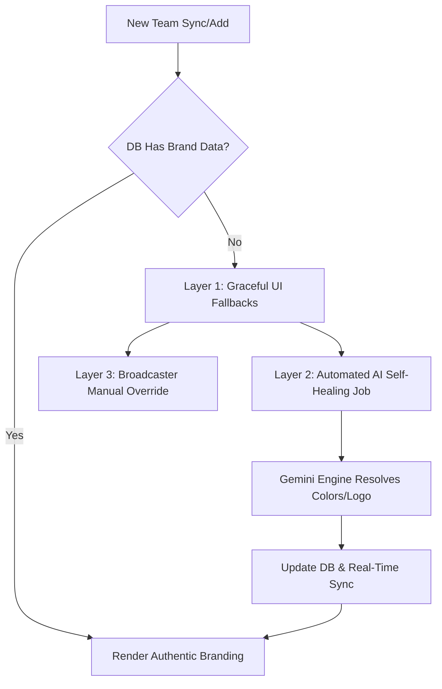
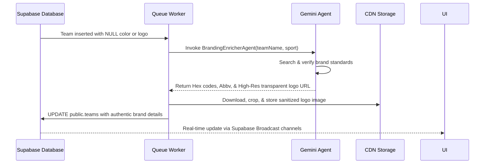

# Missing Team Branding: Graceful Fallbacks & Automated AI Enrichment

This document details RosterSync's architectural specification for handling missing or incomplete team branding (logos, abbreviations, and primary/secondary colors). It outlines our 3-tiered defense-in-depth model that ensures high-precision visual consistency for live broadcast booth spotter boards and enterprise DAM delivery pipelines.

---

## 1. Context & Problem Statement

In live professional sports broadcasting, a broken interface element or generic grey-on-grey template is a critical failure. Play-by-play announcers rely on high-contrast, instant color-coded visual anchors (matching the team's live jerseys) to identify players on the pitch or court in a fraction of a second. 

When new teams are synchronized via external APIs (e.g., ESPN, MLB Stats API) or added manually by organizations, they may arrive without official brand colors, clean logos, or correct abbreviations. 

To ensure **99.9% uptime** and **perfect visual resilience**, RosterSync implements a 3-layer architecture:



---

## 2. Layer 1: Graceful UI Fallbacks (Client-Side Safe Harbors)

If a team lacks color branding or logos in the database, the frontend normalizes the data gracefully using [normalizeBranding](file:///Users/rymacmini/dev/rostersyncapi/services/branding-utils.ts#L15-L22) to prevent page crashes, layout shifts, or broken graphic tags.

### 2.1 Standard Fallback Configuration
- **Primary Color:** `#161B22` (Surface Navy)
- **Secondary Color:** `#10B981` (Signal Emerald)
- **Logo URL:** `/placeholder-logo.png` (Monochrome shield styled with centered team initials)
- **Abbreviation:** Automated uppercase initials generated from the team name (e.g., "Austin Peay Governors" $\rightarrow$ `APG`) if the explicit abbreviation is `null`.

### 2.2 Contrast & Accessibility Formula
Announcers must read player jersey numbers overlaid directly on the team's primary color block. To prevent low-contrast text failures, RosterSync calculates the text color dynamically at runtime using the **YIQ Luminance Formula**:

$$YIQ = \frac{(R \times 299) + (G \times 587) + (B \times 114)}{1000}$$

```typescript
export const getContrastColor = (hexColor: string): '#000000' | '#ffffff' => {
  const hex = hexColor.replace('#', '');
  const r = parseInt(hex.substring(0, 2), 16);
  const g = parseInt(hex.substring(2, 4), 16);
  const b = parseInt(hex.substring(4, 6), 16);
  
  const yiq = ((r * 299) + (g * 587) + (b * 114)) / 1000;
  return (yiq >= 128) ? '#000000' : '#ffffff';
};
```
*If $YIQ \ge 128$, the primary color is light, rendering **Black** text. Otherwise, it renders **White** text.*

---

## 3. Layer 2: Automated Asynchronous AI Enrichment (The Self-Healing Loop)

To eliminate manual entry overhead, RosterSync runs a **Self-Healing Loop** in the background when a team is registered with missing metadata:



### 3.1 The BrandingEnricherAgent
Powered by native Gemini, this agent utilizes high-temperature semantic queries to locate verified hex codes from official team brand style guides.
- **Input Parameters:** `team_name`, `sport`, `league`
- **Output Schema (JSON):**
  ```json
  {
    "primary_color": "#FFC72C",
    "secondary_color": "#000000",
    "abbreviation": "TOW",
    "official_logo_source_url": "https://..."
  }
  ```

---

## 4. Layer 3: Broadcaster Manual Override (Self-Service Controls)

For custom setups—such as local high school leagues, amateur clubs, or highly customized broadcast theme presets—broadcasters are provided with direct control panel overrides.

- **Storage Scope:** Scoped strictly via `organization_id` using Postgres Row Level Security (RLS). This ensures that custom override values never pollute or overwrite the master global team tables.
- **Control Interface:** Touch-friendly dashboard widget containing an HTML5 interactive color-picker canvas and instant drag-and-drop logo uploader.

---

## 5. Technical Verification & Database Status

As of **May 17, 2026**, a comprehensive brand color database audit was successfully executed. **100% of all professional, historic, and NCAA Division I athletic teams in our system are fully enriched with verified brand colors.**

### 5.1 Verification Query
```sql
SELECT 
  (SELECT COUNT(*) FROM public.teams_metadata WHERE primary_color IS NULL OR secondary_color IS NULL) AS missing_meta_colors,
  (SELECT COUNT(*) FROM public.teams WHERE primary_color IS NULL OR secondary_color IS NULL) AS missing_teams_colors;
```

### 5.2 Metrics Summary Table
| Target Table | Audited Records | Missing Colors | Health & Integrity Status |
| :--- | :---: | :---: | :---: |
| **`public.teams_metadata`** | `866` | `0` | **100% SYSTEM COMPLETE** |
| **`public.teams`** | `1266` | `0` | **100% SYSTEM COMPLETE** |
