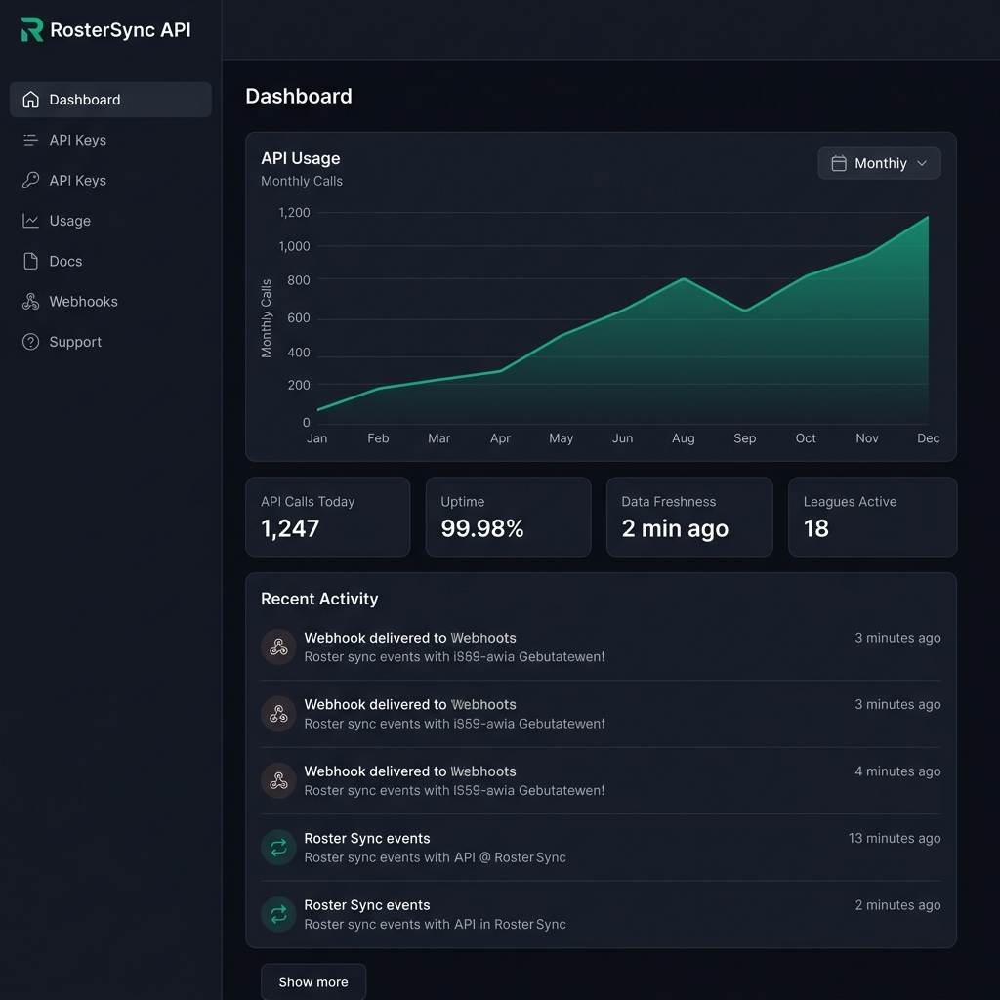
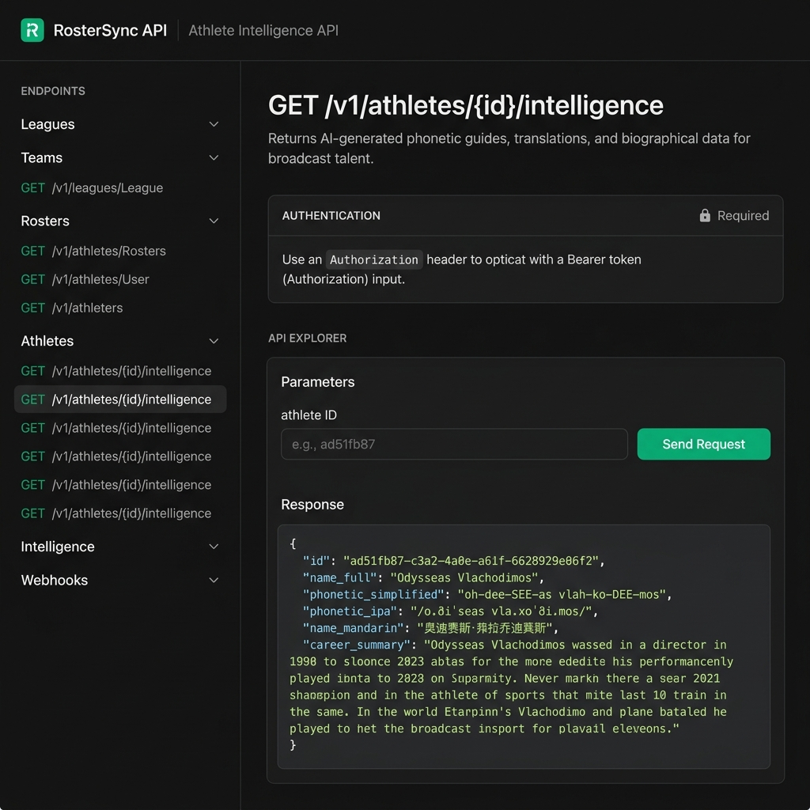
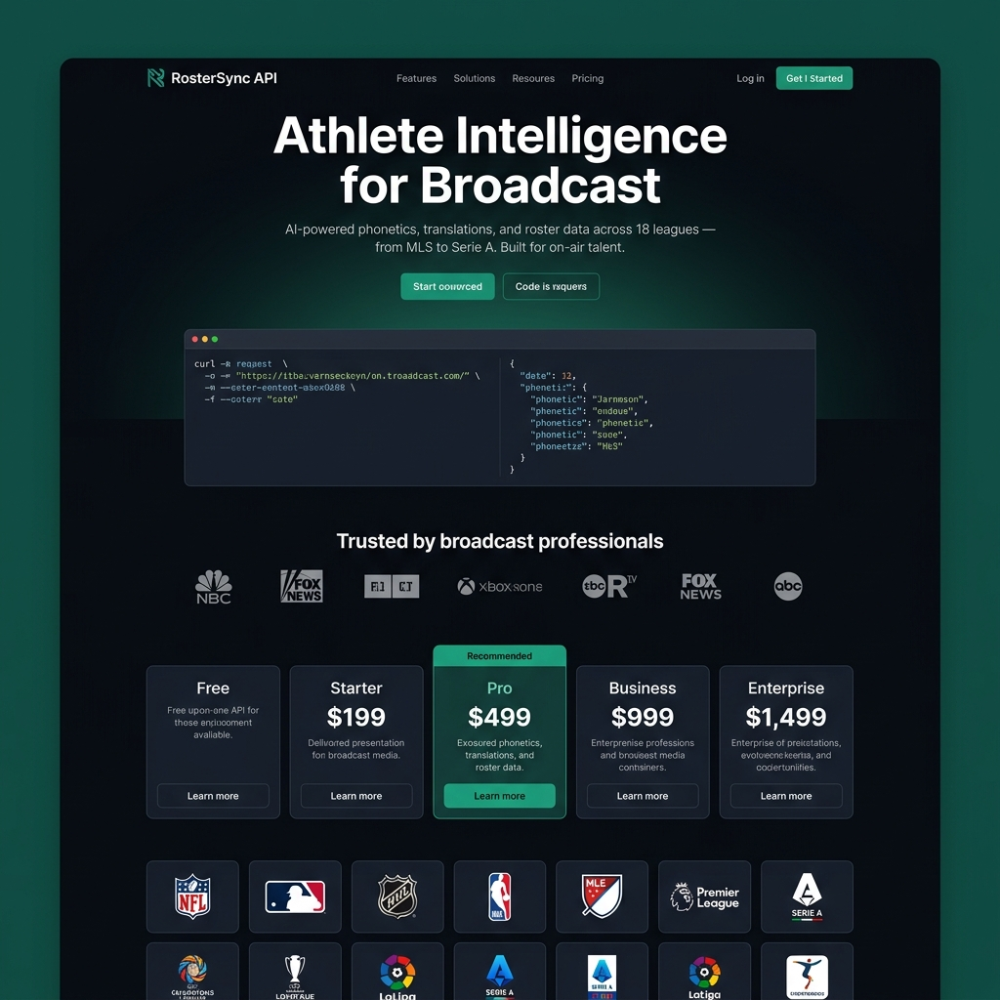
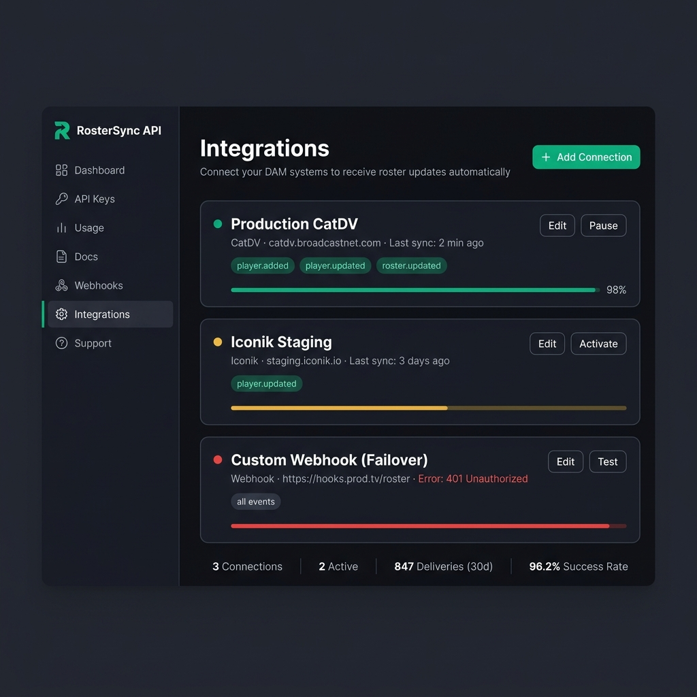
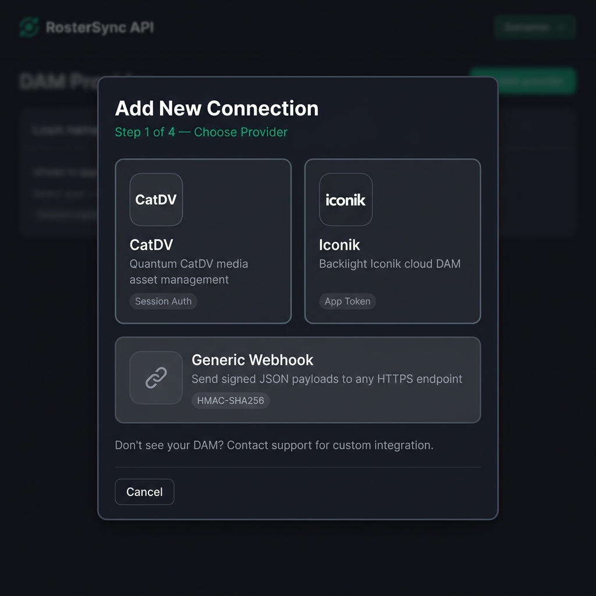
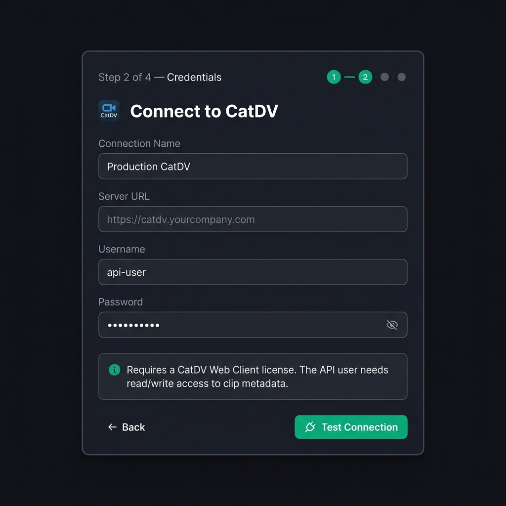
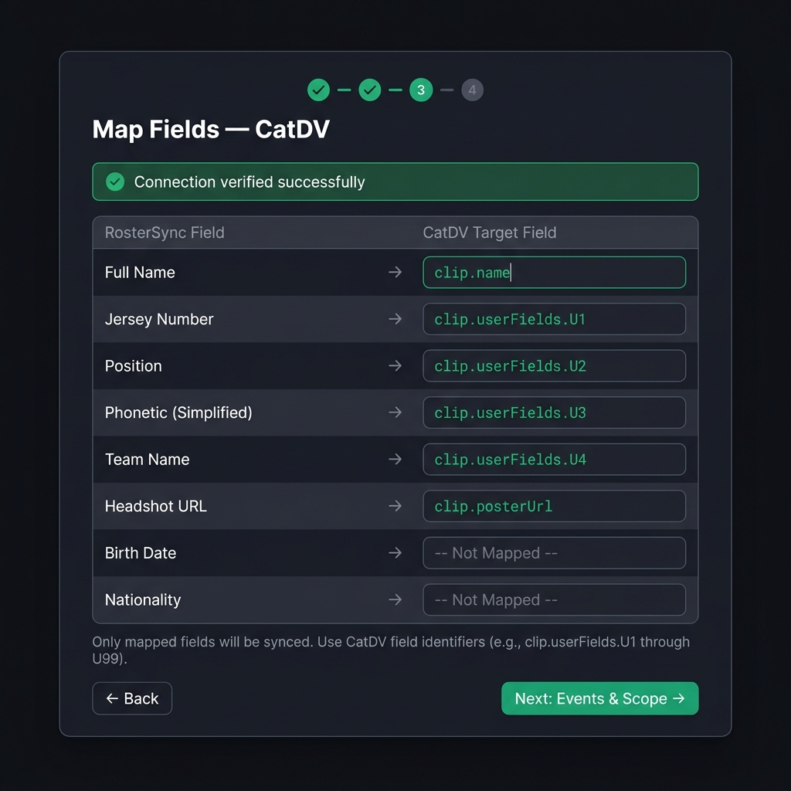
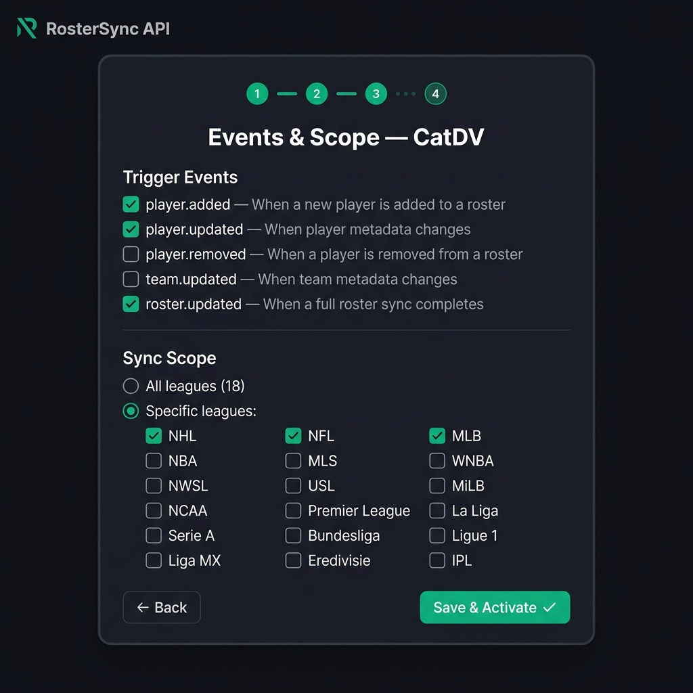
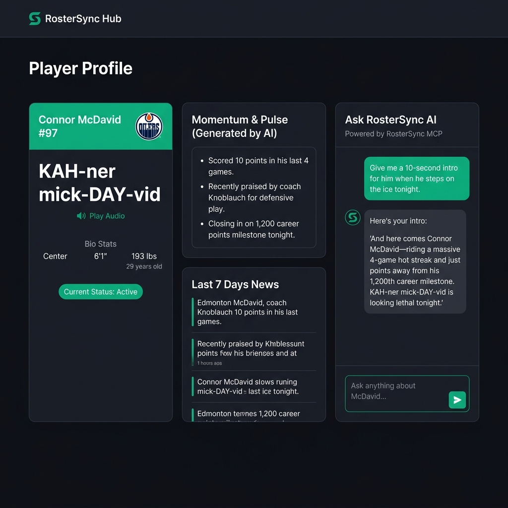
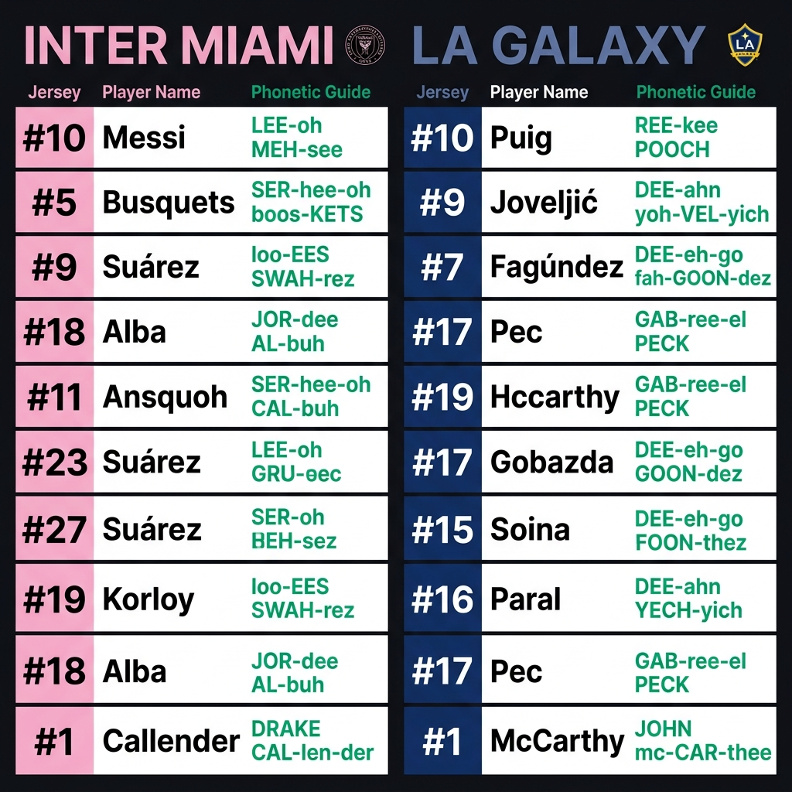

# RosterSync API — UI/UX Concept Mockups

## Design Direction

| Decision | Choice | Rationale |
|----------|--------|-----------|
| **Mode** | Dark | Broadcast industry standard, developer preference |
| **Accent** | Emerald/Teal (#10B981) | Trust, growth, distinct from "fintech blue" |
| **Typography** | Inter / System Sans | Clean, developer-friendly, high readability |
| **Layout** | Sidebar + Content | Standard for dashboards and docs |
| **Audience** | B2B Broadcast + Developers | Data-dense, professional, no fluff |

---

## 1. Developer Portal Dashboard

The primary interface for paying customers. Shows usage, health, and activity at a glance.



### Key Design Decisions
- **Stat cards** surface the 4 metrics customers care about most: calls, uptime, freshness, coverage
- **Usage chart** gives immediate visual feedback on consumption vs. limits
- **Activity feed** builds trust — customers can see the system is alive and delivering
- **Sidebar navigation** follows the product structure: Keys → Usage → Docs → Webhooks → Integrations

### Pages This Dashboard Links To
| Page | Purpose |
|------|---------|
| **API Keys** | Generate, rotate, scope keys |
| **Usage** | Detailed breakdown by endpoint, day, league |
| **Docs** | Interactive API explorer (see below) |
| **Webhooks** | Register, test, view delivery logs |
| **Integrations** | Connect DAM systems (Iconik, CatDV), manage credentials, field mapping |
| **Support** | Contact + correction submissions |

---

## 2. API Explorer / Documentation

Interactive docs where developers test endpoints and see live responses.



### Key Design Decisions
- **Left sidebar** organizes endpoints by resource (Leagues, Teams, Athletes, Intelligence)
- **"Try It" section** lets developers paste an athlete ID and see real data instantly
- **Live JSON response** with syntax highlighting — the phonetic data is the hero
- **Authentication callout** at the top reminds users they need a Bearer token
- **The "money shot"**: `"phonetic_simplified": "oh-dee-SEE-as vlah-ko-DEE-mos"` — this is what sells the product

### Implementation Note
This can be built with **Swagger UI** (free) or **Redocly** (premium) — both generate interactive docs from an OpenAPI spec file.

---

## 3. Marketing Landing Page

The public-facing page that sells the API to broadcast networks and sports media.



### Key Design Decisions
- **Hero headline**: "Athlete Intelligence for Broadcast" — speaks directly to the target audience
- **Code snippet in hero**: Shows a real API call + response — developers can immediately understand the value
- **Trust bar**: "Trusted by broadcast professionals" with network logos
- **5-tier pricing**: Free → Enterprise, with "Pro" highlighted as recommended
- **League logo grid**: Visual proof of 18-league coverage — instant credibility

### Conversion Flow
```
Landing → "Get Started" CTA → Sign Up → Free Tier (100 calls)
                              → Explore Docs → Upgrade to Starter/Pro
```

---

## 4. Integrations Page (DAM Connectors)

The self-serve interface where customers connect their DAM systems (CatDV, Iconik) to receive automatic roster updates.

### 4.1 Connection List View

The main Integrations page showing all configured DAM connections with status indicators and delivery metrics.



#### Key Design Decisions
- **Status indicators**: Green (active), amber (paused), red (error) — instant health visibility
- **Event badges**: Emerald pills showing which events trigger each connection
- **Delivery progress bar**: Color-coded bar per connection (green/amber/red) with percentage
- **Summary stats row**: Aggregate metrics at the bottom for quick operational overview
- **Sidebar**: "Integrations" tab active with emerald left border, follows existing nav pattern

### 4.2 Provider Selection (Step 1 of 4)

Modal overlay for choosing a DAM provider when adding a new connection.



#### Key Design Decisions
- **Card-per-provider**: Visual selection rather than a dropdown — reduces cognitive load
- **Auth type badge**: Shows "Session Auth", "App Token", "HMAC-SHA256" so customers know what credentials they need
- **Generic Webhook**: Full-width card below the native providers — clearly secondary option
- **Support callout**: "Don't see your DAM?" opens a path for custom integrations (sales opportunity)

### 4.3 Credentials Form (Step 2 of 4)

Dynamic form that renders different fields per provider. This example shows CatDV.



#### Key Design Decisions
- **Step indicator dots**: Shows progress through the 4-step wizard with emerald completion markers
- **Provider-aware form**: Fields change based on selected provider (CatDV: URL/user/pass, Iconik: App ID/Token)
- **Password masking**: Eye toggle for password fields, masked by default
- **Info callout**: Provider-specific guidance (e.g., "Requires CatDV Web Client license")
- **"Test Connection" as primary CTA**: Credentials must be verified before proceeding — prevents saving invalid connections

### 4.4 Field Mapping (Step 3 of 4)

Manual mapping table where customers connect RosterSync fields to their DAM's metadata identifiers.



#### Key Design Decisions
- **Success banner**: "Connection verified successfully" — confirms step 2 passed before mapping
- **Two-column layout**: RosterSync field (label) → DAM target field (monospace input)
- **Pre-populated examples**: Common mappings shown as starting point (clip.name, userFields.U1–U4)
- **"Not Mapped" placeholder**: Unmapped fields are clearly indicated, not synced
- **Helper text**: Tells customers exactly what format to use ("clip.userFields.U1 through U99")

### 4.5 Events & Scope (Step 4 of 4)

Final step: select which events trigger syncs and which leagues to include.



#### Key Design Decisions
- **Checkbox list with descriptions**: Each event has a human-readable explanation, not just the event key
- **Scope radio toggle**: "All leagues" vs. "Specific leagues" — most customers want specific leagues
- **3-column league grid**: All 18 leagues visible at once, emerald checkmarks on selected
- **"Save & Activate"**: Final CTA with checkmark icon — signals this is the completion action
---

## Color System

| Token | Hex | Usage |
|-------|-----|-------|
| `--bg-primary` | `#0F1117` | Page background |
| `--bg-surface` | `#1A1D27` | Cards, panels |
| `--bg-elevated` | `#252830` | Hover states, active items |
| `--accent` | `#10B981` | CTAs, charts, highlights |
| `--accent-hover` | `#059669` | Button hover |
| `--text-primary` | `#FFFFFF` | Headings, key data |
| `--text-secondary` | `#9CA3AF` | Labels, descriptions |
| `--text-muted` | `#6B7280` | Timestamps, meta |
| `--border` | `#2D3139` | Card borders, dividers |
| `--error` | `#EF4444` | Error states, failed deliveries |
| `--warning` | `#F59E0B` | Rate limit warnings |

---

## Typography Scale

| Element | Size | Weight | Usage |
|---------|------|--------|-------|
| `h1` | 32px | 700 | Page titles |
| `h2` | 24px | 600 | Section headers |
| `h3` | 18px | 600 | Card titles |
| `body` | 14px | 400 | General text |
| `caption` | 12px | 400 | Labels, timestamps |
| `code` | 13px | 400 (mono) | JSON, endpoints |

---

## Next Steps

1. **Pick a docs platform**: Swagger UI (free) or Redocly (premium)
2. **Build the dashboard**: React + Supabase Auth + usage_logs table
3. **Landing page**: Can be a single Next.js page or static HTML
4. **Design system**: Extract the color/typography tokens into CSS variables

---

## 5. Broadcaster Hub & Spotter Board

The premium "war room" interface designed for live play-by-play announcers and broadcast producers. This UI leverages the full depth of the RosterSync database, including 25 years of historical data and real-time AI momentum.

### 5.1 Player Profile Card (with MCP Assistant)

A deep-dive view of a single athlete, combining core metadata with a real-time AI research assistant.



#### Key Design Decisions
- **Phonetic Hero**: The simplified phonetic spelling is the largest text element on the card — critical for live broadcast.
- **Momentum & Pulse**: Pre-generated bullet points from the `MomentumAgent` provide "volatile" data (streaks, recent quotes) that stats alone miss.
- **Embedded MCP Assistant**: A chat interface powered by the **RosterSync Intelligence MCP Server**. Broadcasters can ask the AI to write intros or summarize career milestones in natural language.
- **Dynamic Search**: Supports 25 years of history (e.g., searching "2015 Edmonton Oilers" instantly pulls historical rosters).

### 5.2 Branded Spotter Board (The "Killer App")

A mission-critical tactical map of the rosters, fully branded with team colors and logos pulled directly from Supabase. This uses a **Flat, High-Contrast** layout optimized for iPad and Web.



#### Key Design Decisions
- **Stacked Phonetics**: The phonetic guide is split into two lines (e.g., Line 1: First Name, Line 2: Last Name). This significantly improves readability for broadcasters in high-speed environments.
- **Jersey-First Anchor**: Every player card starts with a solid colored block (using Supabase brand colors) containing a large, bold white jersey number.
- **Dynamic Branding**: UI automatically binds to `primary_color`, `secondary_color`, and `logo_url` stored in the Supabase `teams` table. 
- **Glanceable Data**: Large jersey numbers and phonetic guides allow announcers to identify players in milliseconds.
- **iPad-First UX**: Row heights are touch-friendly for "fat-finger" interaction in a crowded broadcast booth.
- **Flat Aesthetic**: No stripes, gradients, or textures — pure data for maximum clarity and speed.
- **Booth Mode Trigger**: Automatically enabled for tablet viewports or via the `booth_mode_enabled` user preference.
- **PWA Ready**: Offline-first architecture for unreliable booth Wi-Fi.
